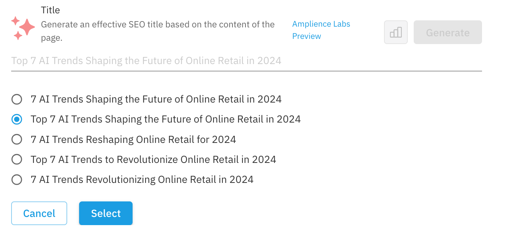
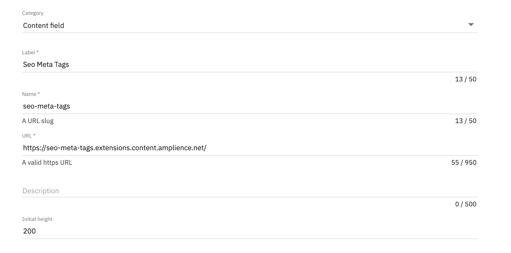
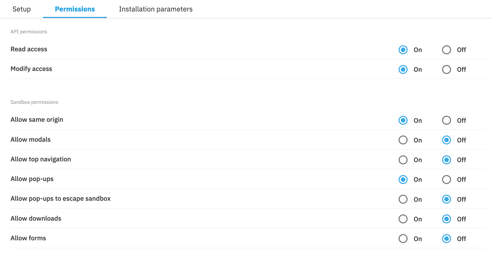

# Automatic Meta Tags

> AI powered meta tag generation for use in [Amplience Dynamic Content](https://amplience.com/dynamic-content)



This extension is designed to generate content for title, description and keywords meta tags based on the content of your content items.

> **Note:** This extension is a [**LABS PREVIEW**](https://amplience.com/developers/docs/knowledge-center/amplience-labs) for use as is without support or warranty

## How to Install

This extension must be [registered](https://amplience.com/developers/docs/integrations/extensions/register-use) against a hub within the Dynamic Content application (Development -> Extensions).



- **Category:** Content Field
- **Label:** Seo Meta Tags
- **Name:** seo-meta-tags (needs to be unique within the hub)
- **URL:** https://seo-meta-tags.extensions.content.amplience.net
- **Description:** (can be left blank, if you wish)
- **Initial height:** 200

### Permissions



#### API permissions:

- Read access
- Modify access

#### Sandbox permissions:

- Allow same origin
- Allow pop-ups

## Assigning the Extension to a Schema

To use the SEO meta tags extension, simply associate it with a string field in your content type schema.

The string field should be configured to use the `ui:extension` property. The `name` property should match the name that was used to register the extension. The `type` parameter must be included to inform the extension what type of meta tag to generate and the `sources` parameter must be included to tell the extension which fields to base the meta tag on.

- The `type` parameter can be either `title`, `description` or `keywords`
- The `sources` parameter should be an array containing valid [JSON pointers](https://datatracker.ietf.org/doc/html/rfc6901) that point to the fields containing your content

> We recommend that you use instance parameters so that the extension only needs to be registered once (see below).

```json
{
  "title": {
    "type": "string",
    "ui:extension": {
      "name": "seo-meta-tags",
      "params": {
        "type": "title",
        "sources": ["/intro", "/body"]
      }
    }
  },
  "description": {
    "type": "string",
    "ui:extension": {
      "name": "seo-meta-tags",
      "params": {
        "type": "description",
        "sources": ["/intro", "/body"]
      }
    }
  },
  "keywords": {
    "type": "string",
    "ui:extension": {
      "name": "seo-meta-tags",
      "params": {
        "type": "keywords",
        "sources": ["/intro", "/body"]
      }
    }
  },
  "intro": {
    "title": "Intro",
    "type": "string"
  },
  "body": {
    "title": "Body",
    "type": "string"
  }
}
```

## Limitations

- This extension is only compatible with hubs that are linked to an organization. Accounts that have not yet [migrated](https://amplience.com/developers/docs/knowledge-center/faqs/account/) from legacy permissions will not be able to use this extension
- This extension is in [**LABS PREVIEW**](https://amplience.com/developers/docs/knowledge-center/amplience-labs) for use as is without support or warranty

## How to run locally

- `npm i`
- `npm run build`
- `npm run preview`
